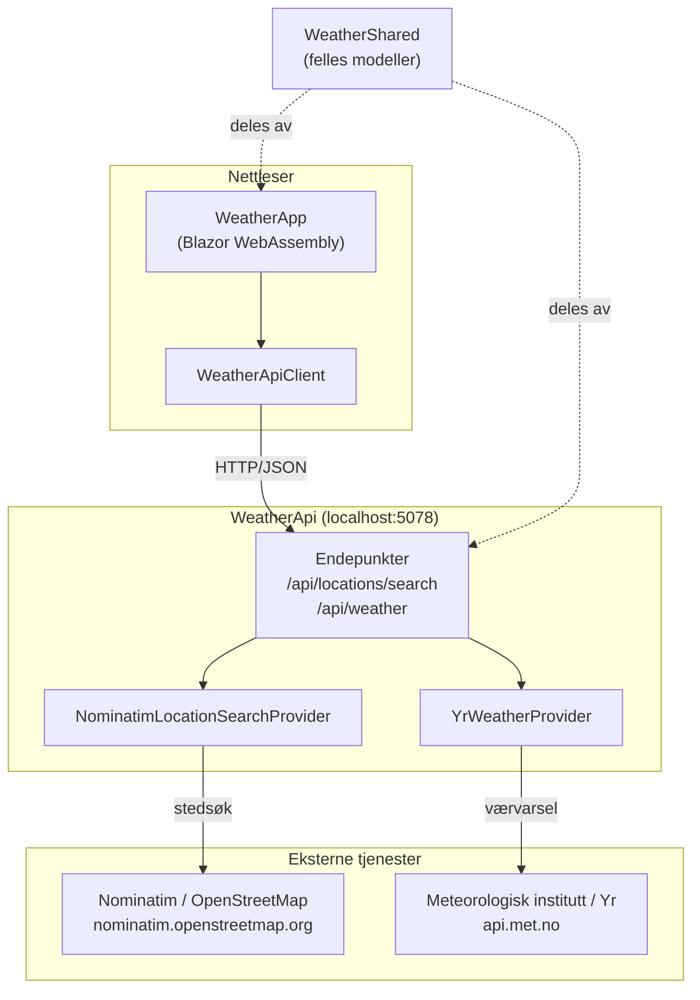
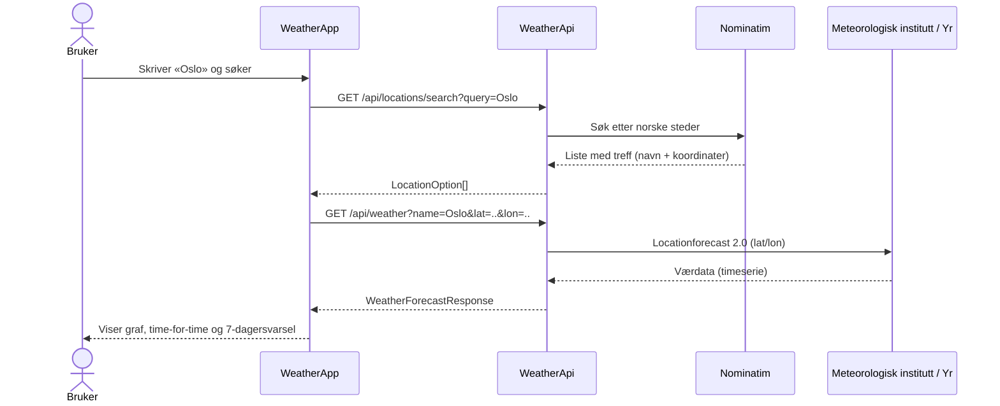

# Arkitektur

Dette dokumentet beskriver hvordan værvarsel-appen er bygd opp, hvordan data flyter
gjennom systemet, og hvilke designvalg som ligger bak.

## Oversikt

Løsningen består av tre prosjekter:

| Prosjekt          | Type                        | Ansvar                                                        |
| ----------------- | --------------------------- | ------------------------------------------------------------- |
| `WeatherApp`      | Blazor WebAssembly          | Brukergrensesnitt som kjører i nettleseren.                   |
| `WeatherApi`      | ASP.NET Core Minimal API    | Mellomledd (proxy) mot eksterne tjenester.                   |
| `WeatherShared`   | Klassebibliotek (.NET)      | Felles datamodeller som deles av frontend og backend.        |

Frontend snakker med `WeatherApi`, ikke direkte med de eksterne tjenestene. Backend
kapsler derfor inn både URL-er, datakontrakter og valg av leverandører.

## Komponent- og dataflyt

## Typisk forløp

## Komponentene i detalj

### WeatherApp (frontend)

Blazor WebAssembly-app som kjører i nettleseren. Hovedsiden (`Pages/Home.razor`)
håndterer stedsøk, valg av sted og visning av varselet. Den bygger blant annet en
SVG-temperaturgraf for de neste 12 timene og grupperer timesdata til et 7-dagersvarsel
på klienten.

All kommunikasjon med backend går gjennom `Services/WeatherApiClient`, som legger på
en tidsavbrudd-grense på 10 sekunder per kall slik at grensesnittet ikke henger ved
treg respons. Adressen til API-et leses fra `wwwroot/appsettings.json`
(`ApiBaseAddress`).

### WeatherApi (backend)

Et ASP.NET Core Minimal API som fungerer som mellomledd. Endepunktene defineres i
`Endpoints/WeatherEndpoints.cs` og validerer inndata (f.eks. at koordinater er gyldige
desimaltall innenfor gyldig område) før de kaller en leverandør.

Selve integrasjonene ligger bak grensesnitt, slik at endepunktene ikke er bundet til en
konkret leverandør:

- `IWeatherProvider` → `YrWeatherProvider` henter værvarsel fra `api.met.no`
  (Locationforecast 2.0, compact). Dette er Meteorologisk institutt sitt offisielle
  API for værdataene som brukes av Yr. Leverandøren oversetter symbolkoder til norske
  beskrivelser (f.eks. `clearsky` → «Klarvær»).
- `ILocationSearchProvider` → `NominatimLocationSearchProvider` søker etter steder via
  Nominatim, begrenset til norske treff (`countrycodes=no`).

Begge leverandørene konfigureres med en egen `HttpClient` i `Program.cs`, der det
settes en identifiserbar `User-Agent` slik tjenestene krever.

### WeatherShared (felles modeller)

Et lite klassebibliotek med datamodellene som både frontend og backend bruker:
`LocationOption` (sted med navn og koordinater) og `WeatherForecastResponse` /
`WeatherForecastPeriod` (selve værvarselet). Ved å samle dem ett sted unngår vi at de
samme typene defineres dobbelt i de to prosjektene.

## Designvalg

**Backend som proxy.** `WeatherApi` holder eksterne detaljer som URL-er, `User-Agent`
og oversettelse av symbolkoder på ett sted, og styrer hvilke lokale klienter som
slipper til via CORS.

**Grensesnitt for leverandørene.** `IWeatherProvider` og `ILocationSearchProvider`
gjør at en datakilde kan byttes ut uten å endre frontend-en. Vil man for eksempel
bruke en annen værtjeneste, lager man en ny implementasjon av `IWeatherProvider`,
mapper svaret til de delte modellene i `WeatherShared`, og registrerer den i
`Program.cs`.

**Delt modellbibliotek.** `WeatherShared` fjerner duplisering av datamodellene. JSON-en
som sendes over nettet er navnebasert, så det samme settet med typer brukes både ved
serialisering (API) og deserialisering (app).

**CORS-låsing.** API-et godtar kun forespørsler fra de lokale Blazor-adressene
(`http://localhost:5208` og `https://localhost:7208`). Endrer du portene, må CORS-reglene
i `Program.cs` oppdateres tilsvarende.

## Porter og konfigurasjon

| Komponent  | Adresse                                          |
| ---------- | ------------------------------------------------ |
| WeatherApi | `http://localhost:5078`                          |
| WeatherApp | `http://localhost:5208`, `https://localhost:7208` |

Se [README.md](README.md) for hvordan du starter prosjektene.
