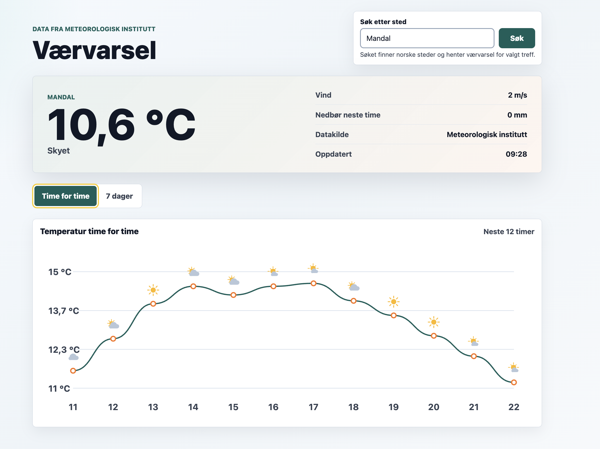
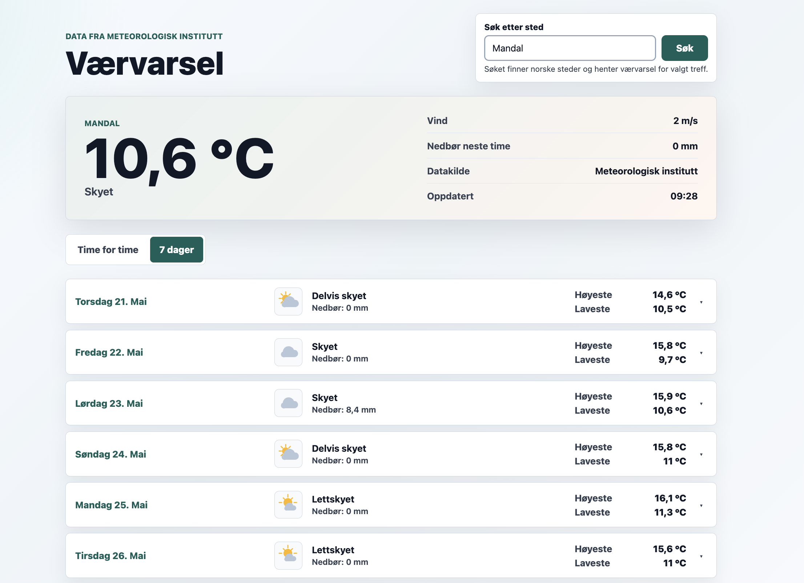
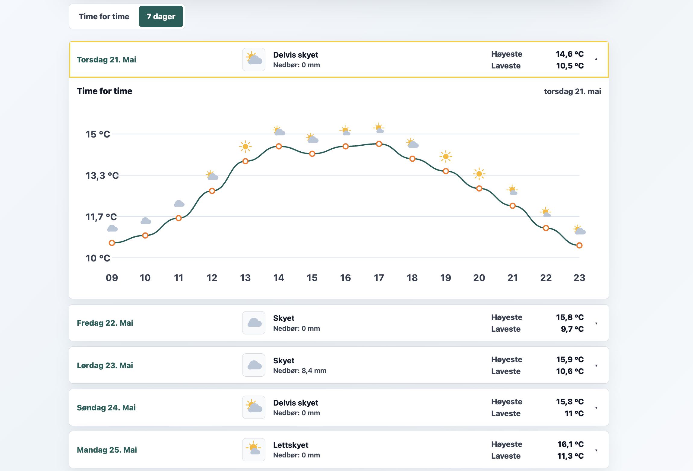

# Værvarsel

En lokal single-page værapp for norske steder. Du søker etter et sted, og appen viser
nåværende vær, en temperaturgraf time for time og et varsel for de neste 7 dagene.
Webapplikasjonen henter alle data via et lokalt ASP.NET Core Web API. Selve
værvarselet kommer fra Yr-grunnlaget til Meteorologisk institutt via `api.met.no`,
mens stedsøket går mot OpenStreetMap (Nominatim).

## Funksjoner

- Søk etter norske steder og hent værvarsel for beste treff.
- Nåværende vær: temperatur, koordinater, værsymbol, vind, nedbør neste time og datakilde.
- «Time for time» med SVG-basert temperaturgraf for de neste 12 timene.
- «7 dager» med daglig varsel, høyeste/laveste temperatur, nedbør og værsymbol.
- Værsymboler og norske beskrivelser av værtype.
- Hele grensesnittet er på norsk.

## Skjermbilder

**Forside med time-for-time-graf**



**7-dagersvisning**



**Utvidet dag**



## Teknologi

- **.NET 10**
- **WeatherApi** – ASP.NET Core Minimal API (backend / proxy mot eksterne tjenester)
- **WeatherApp** – Blazor WebAssembly (frontend)
- **WeatherShared** – delt klassebibliotek med felles datamodeller

## Samsvar med oppgaven

- **Single-page webapplikasjon:** `WeatherApp` er en Blazor WebAssembly-app med én
  hovedside for søk og værvisning.
- **Valgt lokasjon:** Brukeren søker etter et sted, og appen henter vær for beste
  treff automatisk.
- **Web API:** `WeatherApi` er et ASP.NET Core Minimal API som frontend-en bruker for
  både stedsøk og værdata. Værvarselet hentes fra `api.met.no`, Meteorologisk
  institutt sitt offisielle API for dataene som brukes av Yr.
- **Mulig å bytte datakilde:** Værintegrasjonen ligger bak `IWeatherProvider`, slik at
  backend kan få en ny leverandør uten at frontend-en må endres.
- **Lokal kjøring:** Backend og frontend kjøres lokalt på hver sin port.

## Forutsetninger

- [.NET 10 SDK](https://dotnet.microsoft.com/download)
- Internettilgang (appen henter data fra `api.met.no` og `nominatim.openstreetmap.org`)

## Kom i gang

Backend og frontend kjøres som to separate prosesser. Start API-et først.

**1. Start API-et** (i én terminal):

```bash
cd WeatherApi
dotnet run
```

API-et lytter på `http://localhost:5078`.

**2. Start frontend-en** (i en annen terminal):

```bash
cd WeatherApp
dotnet run
```

Appen lytter på `http://localhost:5208` (og `https://localhost:7208`).

**3. Åpne appen** i nettleseren på <http://localhost:5208>.

> **Merk:** Med standard lokal konfigurasjon må frontend-en kjøre på port 5208/7208.
> Andre adresser må legges til via `AllowedOrigins`.

## Konfigurasjon

Adressen til API-et settes i `WeatherApp/wwwroot/appsettings.json`:

```json
{
  "ApiBaseAddress": "http://localhost:5078"
}
```

Endrer du porten API-et kjører på, må du oppdatere denne verdien. Endrer du hvor
frontend-en kjører, må den nye adressen legges til i `AllowedOrigins`.

For publisert frontend brukes `WeatherApp/wwwroot/appsettings.Production.json`.
Se [DEPLOY.md](DEPLOY.md) for deploy-oppsett med Vercel og en .NET-hostet API-tjeneste.

## API-endepunkter

| Metode | Rute                                            | Beskrivelse                                  |
| ------ | ----------------------------------------------- | -------------------------------------------- |
| `GET`  | `/api/locations/search?query={tekst}`           | Søker etter norske steder (minst 2 tegn).    |
| `GET`  | `/api/weather?name={navn}&lat={lat}&lon={lon}&periods={n}` | Henter værvarsel for gitte koordinater. |

Eksempelforespørsler ligger i [`WeatherApi/WeatherApi.http`](WeatherApi/WeatherApi.http).

## Prosjektstruktur

```text
WeatherSolution.slnx          Løsningsfil (samler de tre prosjektene)
DEPLOY.md                     Publiseringsguide for frontend og API
Dockerfile                    Container-oppsett for WeatherApi
vercel.json                   Vercel-oppsett for WeatherApp
vercel-build.sh               Byggeskript for Blazor WebAssembly på Vercel
│
├── WeatherApi/               Backend – ASP.NET Core Minimal API
│   ├── Endpoints/            Definisjon av HTTP-endepunktene
│   ├── Services/             Meteorologisk institutt/Yr (vær) og Nominatim (stedsøk)
│   └── Program.cs            Oppsett av tjenester, CORS og HttpClient
│
├── WeatherApp/               Frontend – Blazor WebAssembly
│   ├── Pages/                Hovedsiden (Home.razor) med graf og varselvisninger
│   ├── Services/             WeatherApiClient – kaller backend-en
│   ├── Layout/               Felles layout
│   └── wwwroot/              Statiske filer og konfigurasjon
│
└── WeatherShared/            Delt klassebibliotek
    └── Models/               LocationOption, WeatherForecastResponse
```

Se [ARCHITECTURE.md](ARCHITECTURE.md) for en nærmere beskrivelse av dataflyten.

## Datakilder

- Værvarsel: [Meteorologisk institutt / Yr](https://api.met.no/) (Locationforecast 2.0)
- Stedsøk: [Nominatim / OpenStreetMap](https://nominatim.org/)

Begge tjenestene krever en identifiserbar `User-Agent`. Denne settes i
`WeatherApi/Program.cs` og bør tilpasses før eventuell produksjonsbruk, i tråd med
tjenestenes vilkår for bruk.

## Bytte værleverandør

For å bruke en annen værtjeneste uten å endre frontend-en kan man:

1. Lage en ny klasse i `WeatherApi/Services` som implementerer `IWeatherProvider`.
2. Mappe svaret fra den nye tjenesten til `WeatherForecastResponse` og
   `WeatherForecastPeriod`.
3. Bytte registreringen i `WeatherApi/Program.cs` fra dagens leverandør til den nye.

Så lenge API-endepunktet returnerer samme delte modeller, fortsetter Blazor-appen å
fungere uten endringer.
